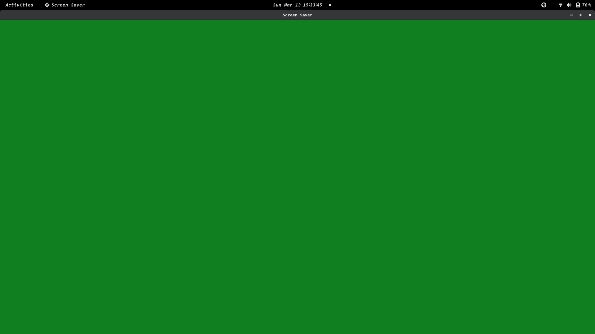

# SCREENSAVER

The screen saver is the first epitech graphical project in C using CSFML.

Screen saver 1 :

Screen saver 2 :

Screen saver 3 :

Screen saver 4 :

Screen saver 5 :

## USAGE

./my_screensaver [screensaver]

Screen savers:

1 - Random bubbles pop everywhere

2 - Bubbles pop only in the center of the screen

3 - All the window changes color

4 - Random bubbles and squares pop everywhere

5 - Random squares pop everywhere
